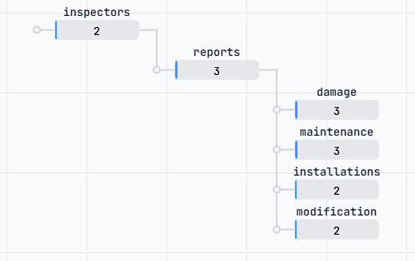

# RealEstateCare API

Een REST API voor de RealEstateCare mobiele webapplicatie.  
Gebouwd met **MockAPI.io** 

Gebruikt door de VUE-applicatie voor RealestateCare 
Extra tools: 
- **Axios** 
- **Vue 3**
- **Vuetify 3**
- **VUE-Router**
Applicatie staat op: 
```
https://github.com/bkdstudent/realestatecare_fa2.git
branch: realestatecare_fa3
```
---

## Base URL

```
https://69bc341b0915748735bb8a4e.mockapi.io/api/v1
```

---

## Authenticatie

In de demo-applicatie wordt authenticatie gesimuleerd via `localStorage`.  
Bij inloggen wordt de inspecteur opgehaald via:

```
GET /inspectors?username=jdev
```

Het wachtwoord wordt client-side vergeleken en het inspecteur-object wordt opgeslagen in `localStorage`.

> ⚠️ Uitsluitend voor demonstratiedoeleinden. In productie wordt two-factor authenticatie of universal login gebruikt.

---

## Resources & Endpoints

### 👤 Inspectors

| Methode  | Endpoint                    | Beschrijving                        |
| -------- | --------------------------- | ----------------------------------- |
| `GET`    | `/inspectors`               | Alle inspecteurs ophalen            |
| `GET`    | `/inspectors/:id`           | Één inspecteur ophalen              |
| `GET`    | `/inspectors?username=jdev` | Inspecteur zoeken op gebruikersnaam |
| `POST`   | `/inspectors`               | Nieuwe inspecteur aanmaken          |
| `PUT`    | `/inspectors/:id`           | Inspecteur bijwerken                |
| `DELETE` | `/inspectors/:id`           | Inspecteur verwijderen              |

**Datamodel:**

```json
{
  "id": "1",
  "username": "jdev",
  "password": "demo1234",
  "name": "Jan de Vries",
  "theme": "light",
  "notifications": true
}
```

---

### 📋 Reports

|Methode|Endpoint|Beschrijving|
|---|---|---|
|`GET`|`/reports`|Alle rapportages ophalen|
|`GET`|`/reports/:id`|Één rapportage ophalen|
|`GET`|`/reports?status=assigned`|Toegewezen rapportages ophalen|
|`GET`|`/reports?status=completed`|Uitgevoerde rapportages ophalen|
|`GET`|`/reports?inspectorId=1`|Rapportages per inspecteur|
|`POST`|`/reports`|Nieuwe rapportage aanmaken|
|`PUT`|`/reports/:id`|Rapportage bijwerken|
|`DELETE`|`/reports/:id`|Rapportage verwijderen|

**Datamodel:**

```json
{
  "id": "1",
  "inspectorId": "1",
  "address": "Kerkstraat 12, Amsterdam",
  "status": "assigned",
  "date": "2025-04-10",
  "tasks": ["damage", "maintenance"]
}
```

> `status`: `assigned` of `completed`  
> `tasks`: `damage`, `maintenance`, `installations`, `modifications`

---

### 💥 Damage (Schade)

|Methode|Endpoint|Beschrijving|
|---|---|---|
|`GET`|`/damage`|Alle schademeldingen ophalen|
|`GET`|`/damage/:id`|Één schademelding ophalen|
|`GET`|`/damage?reportId=1`|Schade per rapportage ophalen|
|`POST`|`/damage`|Nieuwe schademelding aanmaken|
|`PUT`|`/damage/:id`|Schademelding bijwerken|
|`DELETE`|`/damage/:id`|Schademelding verwijderen|

**Datamodel:**

```json
{
  "id": "1",
  "reportId": "1",
  "location": "Woonkamer",
  "newDamage": true,
  "type": "slijtage",
  "date": "2025-04-10",
  "urgent": false,
  "description": "Beschadigde vloerbedekking bij de schuifpui.",
  "photos": []
}
```

> `type`: `moedwillig`, `slijtage`, `geweld`, `normaal gebruik`, `calamiteit`, `anders`

---

### 🔧 Maintenance (Achterstallig onderhoud)

|Methode|Endpoint|Beschrijving|
|---|---|---|
|`GET`|`/maintenance`|Alle onderhoudsmeldingen ophalen|
|`GET`|`/maintenance/:id`|Één onderhoudsmelding ophalen|
|`GET`|`/maintenance?reportId=1`|Onderhoud per rapportage ophalen|
|`POST`|`/maintenance`|Nieuwe onderhoudsmelding aanmaken|
|`PUT`|`/maintenance/:id`|Onderhoudsmelding bijwerken|
|`DELETE`|`/maintenance/:id`|Onderhoudsmelding verwijderen|

**Datamodel:**

```json
{
  "id": "1",
  "reportId": "1",
  "location": "Buitenkozijnen",
  "type": "houtrot",
  "urgent": false,
  "costIndication": "500-1500",
  "photos": []
}
```

> `type`: `schilderwerk`, `houtrot`, `elektra`, `leidingwerk`, `beglazing`  
> `costIndication`: `0-500`, `500-1500`, `1500+`

---

### ⚙️ Installations (Technische installaties)

|Methode|Endpoint|Beschrijving|
|---|---|---|
|`GET`|`/installations`|Alle installaties ophalen|
|`GET`|`/installations/:id`|Één installatie ophalen|
|`GET`|`/installations?reportId=1`|Installaties per rapportage ophalen|
|`POST`|`/installations`|Nieuwe installatie aanmaken|
|`PUT`|`/installations/:id`|Installatie bijwerken|
|`DELETE`|`/installations/:id`|Installatie verwijderen|

**Datamodel:**

```json
{
  "id": "1",
  "reportId": "1",
  "location": "CV-ruimte",
  "type": "verwarming",
  "malfunctions": "Ketel slaat af bij hoog vermogen.",
  "approved": false,
  "comments": "Onderhoud vereist.",
  "photos": []
}
```

> `type`: `koeling`, `verwarming`, `luchtverversing`, `elektra`, `beveiliging`

---

### 🏗️ Modifications (Modificaties)

|Methode|Endpoint|Beschrijving|
|---|---|---|
|`GET`|`/modifications`|Alle modificaties ophalen|
|`GET`|`/modifications/:id`|Één modificatie ophalen|
|`GET`|`/modifications?reportId=1`|Modificaties per rapportage ophalen|
|`POST`|`/modifications`|Nieuwe modificatie aanmaken|
|`PUT`|`/modifications/:id`|Modificatie bijwerken|
|`DELETE`|`/modifications/:id`|Modificatie verwijderen|

**Datamodel:**

```json
{
  "id": "1",
  "reportId": "1",
  "location": "Keuken",
  "executedBy": "huurder",
  "description": "Extra stopcontact geplaatst.",
  "action": "laten keuren",
  "comments": "Keuring door erkend installateur vereist.",
  "photos": []
}
```

> `executedBy`: `huurder`, `aannemer`, `onbekend`  
> `action`: `accepteren`, `laten keuren`, `laten verwijderen`, `laten aanpassen en keuren`

---

### 📚 Documents (Kennisbase)

|Methode|Endpoint|Beschrijving|
|---|---|---|
|`GET`|`/documents`|Alle documenten ophalen|
|`GET`|`/documents/:id`|Één document ophalen|
|`GET`|`/documents?category=normblad`|Documenten per categorie|
|`POST`|`/documents`|Nieuw document toevoegen|
|`PUT`|`/documents/:id`|Document bijwerken|
|`DELETE`|`/documents/:id`|Document verwijderen|

**Datamodel:**

```json
{
  "id": "1",
  "title": "NEN 2767 Conditiemeting",
  "category": "normblad",
  "url": "/docs/nen2767.pdf"
}
```

> `category`: `normblad`, `testprocedure`, `protocol`

---

## Gebruik in Vue 3 met Axios

Alle API-calls verlopen via `src/services/api.js`:

```javascript
import api from '@/services/api.js'

// In een component
onMounted(async () => {
  const response = await api.getCompletedReports()
  reports.value = response.data
})
```

---

## Technische details

**Platform**|MockAPI.io|

| **Framework**   | Vue 3 + Vuetify 3             |
| --------------- | ----------------------------- |
| **HTTP client** | Axios                         |
| **Dataformaat** | JSON                          |
| **ID-type**     | STRING, dus "1" , **NIET**: 1 |
⚠️ **Let op:** MockAPI gebruikt altijd string IDs. Bij vergelijking `===` gebruiken

---

## Notities

- `POST`, `PUT` en `DELETE` vereisen een `Content-Type: application/json` header
- Data wordt verstuurd als JSON in de **body** van het request, niet als query parameter
- MockAPI reset geen data automatisch — wijzigingen zijn persistent zolang de resource bestaat